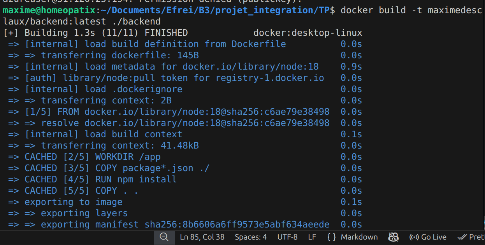
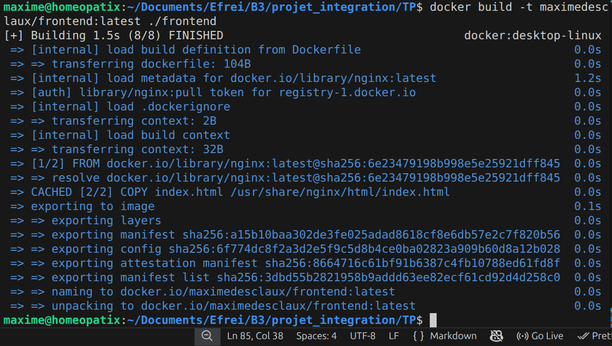
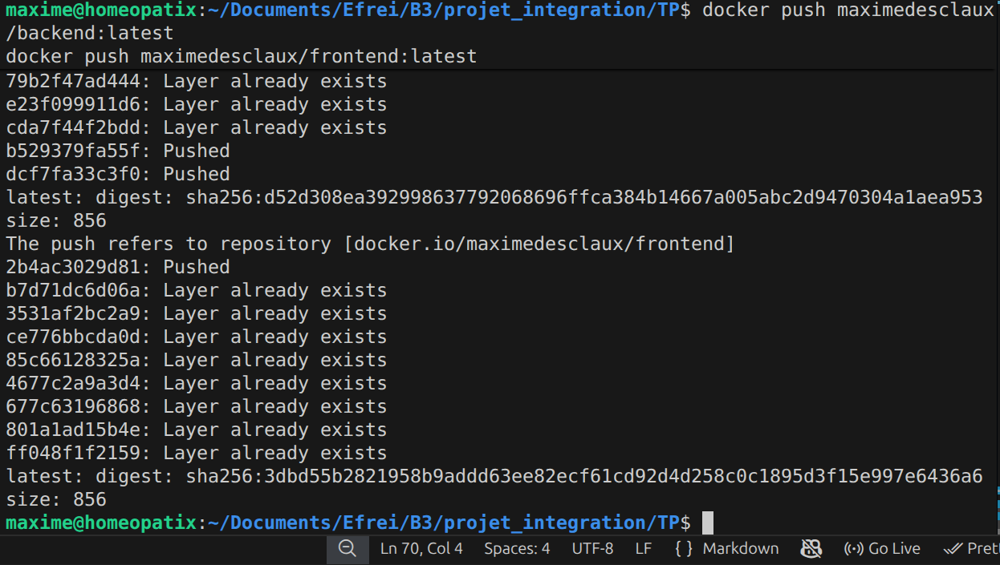
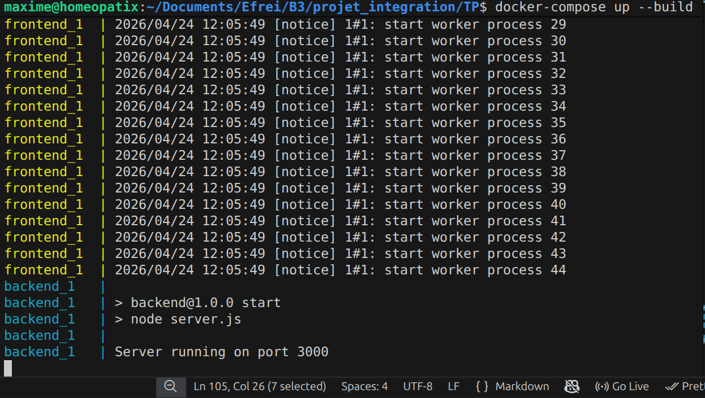
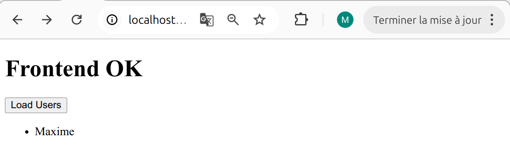

# Projet : Automatisation du déploiement d'une application web
 
---
 
## 1. Contexte du projet
 
Ce projet a pour objectif de simuler une chaîne complète de **déploiement automatisé d'une application web** dans un contexte DevOps.
 
**Objectifs principaux :**
- Réduire les erreurs humaines
- Automatiser le build et le déploiement
- Déployer une application dans le cloud
- Utiliser des outils modernes (Docker, Kubernetes, CI/CD)
---
 
## 2. Architecture globale
 
L'application est composée de deux services :
 
| Service | Description |
|---------|-------------|
| 🌐 Frontend | Page web statique servie par Nginx |
| ⚙️ Backend | API Node.js avec Express |
 
**Chaîne de déploiement :**
 
```
Frontend → Backend → Docker → Docker Compose → VM Azure → Kubernetes (K3s)
```
 
---
 
## 3. Conteneurisation avec Docker
 
### Objectif
 
Transformer chaque service en conteneur pour garantir la portabilité, l'isolation et la reproductibilité.
 
---
 
### 3.1 Backend (Node.js + Express)
 
```dockerfile
FROM node:18
 
WORKDIR /app
 
COPY package*.json ./
RUN npm install
 
COPY . .
 
EXPOSE 3000
 
CMD ["node", "server.js"]
```
 
**Fonctionnalités :**
- API REST
- Endpoint `/health`
- Retour JSON (état du service)
---
 
### 3.2 Frontend (Nginx)
 
```dockerfile
FROM nginx:latest
 
COPY index.html /usr/share/nginx/html/index.html
```
 
**Fonctionnalités :**
- Page HTML statique
- Affichage d'un message d'accueil
- Peut appeler le backend
---
 
### 3.3 Build et push des images Docker
 
**Build :**
```bash
docker build -t maximedesclaux/backend:latest ./backend
docker build -t maximedesclaux/frontend:latest ./frontend
```


 
**Push DockerHub :**
```bash
docker push maximedesclaux/backend:latest
docker push maximedesclaux/frontend:latest
```
 

 
---
 
## 4. Docker Compose (tests locaux)
 
### Objectif
 
Lancer les deux services ensemble pour tester la communication frontend/backend en local.
 
```bash
docker-compose up --build
```
 
**Résultat attendu :**
- Frontend accessible en local
- Backend accessible via API
- Communication fonctionnelle



---
 
## 5. Déploiement sur Azure (VM)
 
### 5.1 Machine virtuelle
 
| Paramètre | Valeur |
|-----------|--------|
| OS | Ubuntu |
| Cloud | Azure |
| Accès | SSH |

### 5.2 Installation des outils
 
```bash
sudo apt update
sudo apt install docker.io -y
sudo apt install docker-compose -y
```
 
### 5.3 Installation Kubernetes (K3s)
 
```bash
curl -sfL https://get.k3s.io | sh -
 
# Vérification
kubectl get nodes
```
 
---
 
## 6. Déploiement Kubernetes
 
### 6.1 Namespace
 
```yaml
apiVersion: v1
kind: Namespace
metadata:
  name: tp-app
```
 
### 6.2 Backend Deployment
 
```yaml
image: maximedesclaux/backend:latest
```
 
### 6.3 Frontend Deployment
 
```yaml
image: nginx:latest
```
 
### 6.4 Services Kubernetes
 
| Service | Type | NodePort |
|---------|------|----------|
| Frontend | NodePort | 30080 |
| Backend | NodePort | 30001 |
 
### 6.5 Déploiement
 
```bash
kubectl apply -f k8s/
```
 
> 📸 *Captures à ajouter : pods running, services exposés, accès frontend via `IP:30080`*
 
---
 
## 7. Variables d'environnement
 
ConfigMap utilisé pour injecter les variables dans les pods :
 
```yaml
apiVersion: v1
kind: ConfigMap
metadata:
  name: app-config
  namespace: tp-app
data:
  NODE_ENV: "production"
  PORT: "3000"
```
 
---
 
## 8. Communication entre services
 
Dans Kubernetes, le frontend appelle le backend via le service interne :
 
```
http://backend-service:3000
```
 
---
 
## 9. Problèmes rencontrés
 
### ❌ 9.1 ConfigMap frontend introuvable
 
**Erreur :**
```
configmap "frontend-html" not found
```
 
**Cause :** Ancienne architecture utilisant un ConfigMap pour servir le HTML dans le pod nginx.
 
**Solution :** Suppression du volume ConfigMap dans `frontend.yml` et re-déploiement avec l'image nginx directement.
 
---
 
### ❌ 9.2 Docker push refusé
 
**Erreur :**
```
insufficient_scope: authorization failed
```
 
**Cause :** Mauvais repository DockerHub ou permissions insuffisantes.
 
**Solution :** Utilisation du bon nom d'image :
```
maximedesclaux/frontend:latest
```
 
---
 
## 10. CI/CD (non finalisé)
 
### Objectif
 
Automatiser complètement le pipeline :
 
```
git push → build → test → docker build → docker push → SSH VM → kubectl apply
```
 
### Outils prévus
 
- GitHub Actions
- DockerHub
- SSH Azure VM
> 📌 **Statut : non finalisé mais prévu**
 
---
 
## 11. Résultat final
 
| Composant | Statut |
|-----------|--------|
| Backend | ✅ Fonctionnel |
| Frontend | ✅ Fonctionnel |
| Docker | ✅ OK |
| Kubernetes | ✅ OK |
| VM Azure | ✅ OK |
| Communication inter-services | ✅ OK |
 
---
 
## 12. Captures à fournir
 
**Obligatoires :**
- `docker build` backend/frontend
- `docker push` DockerHub
- `docker-compose up`
- `kubectl get nodes`
- `kubectl get pods`
- `kubectl get services`
- Accès frontend navigateur (`IP:30080`)
- Endpoint backend `/health`
**Bonus :**
- Erreurs frontend Kubernetes
- Correction déploiement
- Architecture finale
---
 
## 13. Conclusion
 
Ce projet met en place une chaîne complète DevOps :
 
- **Docker** pour conteneuriser les services
- **Docker Compose** pour les tests locaux
- **Azure** pour l'infrastructure cloud
- **Kubernetes** pour l'orchestration
- **CI/CD** (préparation pour automatisation complète)
> 👉 L'objectif principal est atteint : l'application est déployée et fonctionnelle dans un environnement cloud orchestré.
Ce projet m’a permis de comprendre le cycle complet DevOps, de la conteneurisation jusqu’au déploiement cloud avec Kubernetes.
---
 
## 14. Améliorations possibles (bonus)
 
- CI/CD complet avec GitHub Actions
- Monitoring avec Prometheus / Grafana
- Terraform pour créer la VM automatiquement
- HTTPS + Ingress Kubernetes
 